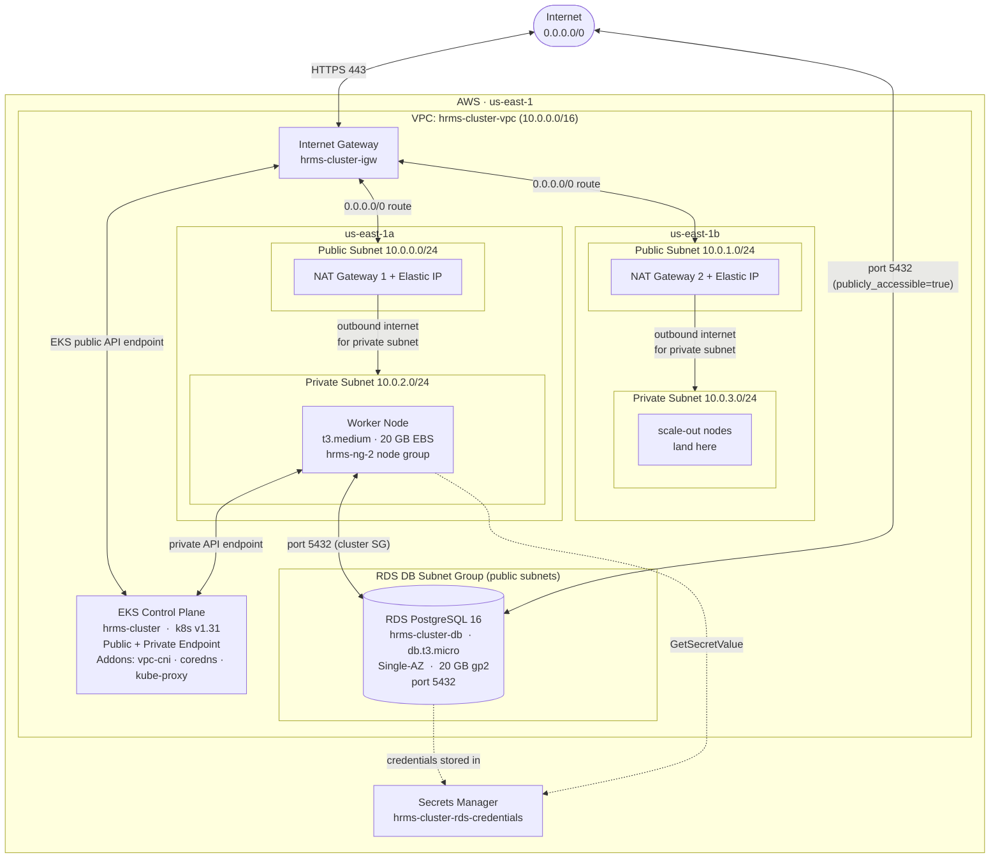

# EKS Cluster - Terraform Configuration

This directory contains Terraform configuration files to create an AWS EKS cluster equivalent to the eksctl configuration.

## Prerequisites

- [Terraform](https://www.terraform.io/downloads.html) >= 1.0
- [AWS CLI](https://aws.amazon.com/cli/) configured with credentials
- [kubectl](https://kubernetes.io/docs/tasks/tools/) installed

## Quick Start Scripts

Two helper scripts are provided to automate common workflows. Use the right one for your situation:

### `create.sh` — First-time deployment

Use this when you are starting **from scratch** with no existing Terraform state or AWS resources.

```bash
./create.sh
```

What it does:
1. `terraform init` — downloads providers and initializes the backend
2. `terraform plan` — shows what will be created
3. `terraform apply -auto-approve` — provisions all resources

**When to use:**
- First time running this project in a new environment
- After deleting `.terraform/` and all state files for a clean restart
- Switching to a different AWS account/region

---

### `recreate.sh` — Re-deploy after state drift or partial failure

Use this when resources already exist (or partially exist) in AWS but the Terraform state is **out of sync**, and you want to re-apply without a full destroy.

```bash
./recreate.sh
```

What it does:
1. Runs `cleanup.sh` — removes specific resources from Terraform state (EKS cluster, node group, Secrets Manager secrets) without deleting the actual AWS resources
2. `terraform apply -auto-approve` — re-registers and re-applies those resources

**When to use:**
- Resources exist in AWS but Terraform errors like `AlreadyExistsException` or `AccessDeniedException` on secrets from a previous account
- EKS cluster or node group was created outside Terraform (e.g. eksctl) and you want Terraform to manage it going forward
- A previous `create.sh` run failed mid-way and state is partially stale

> **Note:** `recreate.sh` does **not** run `terraform init`. If you've never initialized in the current directory, run `terraform init` or `create.sh` first.

---

## Architecture

This Terraform configuration creates:

- **VPC** with public and private subnets across 2 availability zones
- **EKS Cluster** with version 1.31 (configurable)
- **Managed Node Group** with t3.medium instances
- **Essential Addons**: vpc-cni, kube-proxy, coredns
- **IAM Roles** and policies for cluster and node groups
- **Security Groups** with proper configurations
- **NAT Gateways** for private subnet internet access

### Network Diagram



> **Security note:** RDS is placed in public subnets with `publicly_accessible = true` and SG port 5432 open to `0.0.0.0/0`. This is intentional for this dev/learning environment. Lock down the security group and set `publicly_accessible = false` before using in production.

## File Structure

```
eks-rds-postgres/
├── provider.tf          # Terraform and AWS provider configuration
├── variables.tf         # Variable definitions (EKS)
├── rds-variables.tf     # Variable definitions (RDS)
├── terraform.tfvars     # Variable values
├── vpc.tf               # VPC, subnets, NAT gateways, route tables
├── eks-cluster.tf       # EKS cluster and IAM roles
├── eks-node-group.tf    # Managed node group configuration
├── eks-addons.tf        # EKS addons (vpc-cni, coredns, kube-proxy)
├── rds.tf               # RDS instance, security group, subnet group
├── rds-secrets.tf       # AWS Secrets Manager for DB credentials
├── outputs.tf           # Output values
├── create.sh            # First-time deployment script
├── recreate.sh          # Re-deploy after state drift
├── cleanup.sh           # Remove stale state entries
├── .gitignore           # Git ignore rules
├── README.md            # This file (EKS documentation)
└── RDS-README.md        # RDS-specific documentation
```

## Configuration

### Variables

Key variables in `terraform.tfvars`:

| Variable | Default | Description |
|----------|---------|-------------|
| `aws_region` | us-east-1 | AWS region |
| `cluster_name` | hrms-cluster | EKS cluster name |
| `cluster_version` | 1.31 | Kubernetes version |
| `node_instance_type` | t3.medium | EC2 instance type |
| `node_desired_size` | 1 | Desired number of nodes |
| `node_min_size` | 1 | Minimum number of nodes |
| `node_max_size` | 1 | Maximum number of nodes |
| `node_disk_size` | 20 | Disk size in GB |
| `vpc_cidr` | 10.0.0.0/16 | VPC CIDR block |

Edit `terraform.tfvars` to customize values.

## Pre-Deployment Cleanup (Fresh Environment)

**IMPORTANT:** If you have existing EKS resources created with eksctl or previous Terraform runs, clean them up first to avoid conflicts and ensure a fresh deployment.

### Check Existing Resources

```bash
# Check for existing EKS clusters
aws eks list-clusters --region us-east-1

# Check for existing VPCs with your cluster name
aws ec2 describe-vpcs --filters "Name=tag:Name,Values=*hrms-cluster*" --region us-east-1 --query 'Vpcs[*].[VpcId,Tags[?Key==`Name`].Value|[0]]' --output table

# Check existing RDS instances
aws rds describe-db-instances --region us-east-1 --query 'DBInstances[*].[DBInstanceIdentifier,DBInstanceStatus]' --output table
```

### Cleanup Using eksctl (if cluster was created with eksctl)

```bash
# Delete entire cluster (includes node groups, addons, etc.)
eksctl delete cluster --name hrms-cluster --region us-east-1

# Verify deletion
eksctl get cluster --region us-east-1
```

### Cleanup Using Terraform (if previous Terraform state exists)

```bash
cd terraform

# View current state
terraform state list

# Option 1: Destroy all resources managed by Terraform
terraform destroy

# Option 2: Remove specific resources from state without deleting (if they'll be recreated)
terraform state rm aws_eks_cluster.main
terraform state rm aws_eks_node_group.main
# etc.

# Fix cross-account or orphaned secret errors
# If you get AccessDeniedException for secrets from a different AWS account:
terraform state rm aws_secretsmanager_secret.rds_credentials
terraform state rm aws_secretsmanager_secret_version.rds_credentials
```

### Manual Cleanup (if needed)

If resources weren't created with Terraform or eksctl, delete manually:

```bash
# Delete EKS cluster
aws eks delete-cluster --name hrms-cluster --region us-east-1

# Delete node groups first (before cluster)
aws eks delete-nodegroup --cluster-name hrms-cluster --nodegroup-name hrms-ng-2 --region us-east-1

# Delete RDS instance
aws rds delete-db-instance --db-instance-identifier hrms-cluster-db --skip-final-snapshot --region us-east-1

# Delete Secrets Manager secrets
aws secretsmanager delete-secret --secret-id hrms-cluster-rds-credentials --force-delete-without-recovery --region us-east-1

# Wait for resources to be deleted (5-10 minutes)
aws eks describe-cluster --name hrms-cluster --region us-east-1 2>&1 | grep -q "ResourceNotFoundException" && echo "Cluster deleted"
```

### Clean Terraform State

```bash
# Remove state files (for completely fresh start)
rm -rf .terraform
rm -f terraform.tfstate
rm -f terraform.tfstate.backup
rm -f .terraform.lock.hcl
rm -f tfplan

# Re-initialize
terraform init
```

### Verify Clean Environment

```bash
# Verify no EKS clusters
aws eks list-clusters --region us-east-1 --output table

# Verify no RDS instances with your name
aws rds describe-db-instances --query "DBInstances[?contains(DBInstanceIdentifier, 'hrms-cluster')]" --region us-east-1 --output table

# Check CloudFormation stacks (eksctl creates these)
aws cloudformation list-stacks --stack-status-filter CREATE_COMPLETE UPDATE_COMPLETE --region us-east-1 --query "StackSummaries[?contains(StackName, 'eksctl-hrms-cluster')]" --output table
```

## Usage

### 1. Initialize Terraform

```bash
cd terraform
terraform init
```

This downloads required providers and initializes the backend.

### 2. Review Plan

```bash
terraform plan
```

Review what resources will be created.

### 3. Apply Configuration

```bash
terraform apply
```

Type `yes` when prompted. This will take ~15-20 minutes.

### 4. Configure kubectl

After cluster creation, update kubeconfig:

```bash
aws eks update-kubeconfig --name hrms-cluster --region us-east-1
```

### 5. Verify Cluster

```bash
# Check cluster info
kubectl cluster-info

# Check nodes
kubectl get nodes

# Check system pods
kubectl get pods -n kube-system
```

## Management Commands

### View Current State

```bash
# Show current state
terraform show

# List all resources
terraform state list

# Show specific resource
terraform state show aws_eks_cluster.main
```

### Update Configuration

1. Edit `terraform.tfvars` or relevant `.tf` files
2. Review changes:
   ```bash
   terraform plan
   ```
3. Apply changes:
   ```bash
   terraform apply
   ```

### Scale Node Group

Edit `terraform.tfvars`:
```hcl
node_desired_size = 2
node_min_size     = 1
node_max_size     = 3
```

Then apply:
```bash
terraform apply
```

### Upgrade Cluster Version

Edit `terraform.tfvars`:
```hcl
cluster_version = "1.32"
```

Then apply:
```bash
terraform apply
```

**Note:** Node group may need to be updated separately after cluster upgrade.

### Add Addons

Edit `eks-addons.tf` to add new addons. Example for EBS CSI driver:

```hcl
resource "aws_eks_addon" "ebs_csi" {
  cluster_name = aws_eks_cluster.main.name
  addon_name   = "aws-ebs-csi-driver"

  tags = {
    Name        = "aws-ebs-csi-driver"
    Environment = var.environment
  }
}
```

Then apply:
```bash
terraform apply
```

### Destroy Resources

**Warning:** This will delete ALL resources including data.

```bash
terraform destroy
```

Type `yes` when prompted.

### Destroy Specific Resources

```bash
# Destroy only node group
terraform destroy -target=aws_eks_node_group.main

# Destroy node group and recreate
terraform apply
```

## Outputs

After applying, Terraform displays:

- `cluster_endpoint` - API server endpoint
- `cluster_name` - Cluster name
- `cluster_version` - Kubernetes version
- `node_group_id` - Node group identifier
- `vpc_id` - VPC identifier
- `kubeconfig_command` - Command to configure kubectl

View outputs anytime:
```bash
terraform output
```

## State Management

### Backend Configuration (Optional)

For team environments, use remote backend. Add to `provider.tf`:

```hcl
terraform {
  backend "s3" {
    bucket = "your-terraform-state-bucket"
    key    = "eks/hrms-cluster/terraform.tfstate"
    region = "us-east-1"
  }
}
```

### State Commands

```bash
# List resources in state
terraform state list

# Show resource details
terraform state show aws_eks_cluster.main

# Remove resource from state (doesn't delete actual resource)
terraform state rm aws_eks_addon.coredns

# Import existing resource
terraform import aws_eks_cluster.main hrms-cluster
```

## Troubleshooting

### Node Group Creation Fails

**Issue:** Node group fails to create or nodes are not ready.

**Solution:**
```bash
# Check node group status
aws eks describe-nodegroup --cluster-name hrms-cluster --nodegroup-name hrms-ng-2 --region us-east-1

# Check CloudWatch logs
aws logs tail /aws/eks/hrms-cluster/cluster --follow
```

### VPC Resource Limits

**Issue:** Cannot create more VPCs or subnets.

**Solution:** Delete unused VPCs or request limit increase.

### Addon Errors

**Issue:** Addons fail to install or show degraded status.

**Solution:**
```bash
# Check addon status
aws eks describe-addon --cluster-name hrms-cluster --addon-name coredns --region us-east-1

# Update addon
terraform apply -target=aws_eks_addon.coredns
```

### State Lock Issues

**Issue:** State is locked by another operation.

**Solution:**
```bash
# Force unlock (use with caution)
terraform force-unlock <LOCK_ID>
```

## Cost Optimization

### Estimated Costs (us-east-1)

- **EKS Cluster:** $0.10/hour (~$73/month)
- **t3.medium instance:** $0.0416/hour (~$30/month)
- **NAT Gateway:** $0.045/hour (~$33/month) × 2 = ~$66/month
- **EBS Volume (20GB gp2):** ~$2/month
- **Data Transfer:** Variable

**Total:** ~$171/month

### Cost Saving Tips

1. **Use single NAT Gateway** (edit `vpc.tf`):
   - Change NAT gateway count from 2 to 1
   - Update route tables accordingly
   - Saves ~$33/month

2. **Stop when not in use**:
   ```bash
   # Delete node group
   terraform destroy -target=aws_eks_node_group.main
   
   # Recreate when needed
   terraform apply
   ```

3. **Use t3.small** for testing:
   ```hcl
   node_instance_type = "t3.small"
   ```

4. **Spot instances** (add to node group):
   ```hcl
   capacity_type = "SPOT"
   ```

## Comparison: Terraform vs eksctl

| Feature | Terraform | eksctl |
|---------|-----------|--------|
| Infrastructure as Code | ✅ Full control | ✅ Kubernetes-focused |
| VPC Management | Manual configuration | Auto-creates |
| State Management | Terraform state | CloudFormation |
| Multi-cloud | ✅ Yes | ❌ AWS only |
| Customization | ✅ High | Limited |
| Learning Curve | Moderate | Easy |
| Team Collaboration | ✅ Better with remote state | Limited |

## Best Practices

1. **Version Control**: Commit all `.tf` files to git
2. **Remote State**: Use S3 backend for team environments
3. **Variables**: Use `terraform.tfvars` for customization
4. **Modules**: For multiple clusters, create reusable modules
5. **Tags**: Add comprehensive tags for cost tracking
6. **Validation**: Always run `terraform plan` before apply
7. **Backup**: Keep state file backups
8. **Documentation**: Comment complex configurations

## Migration from eksctl

To migrate existing eksctl cluster:

1. Import existing resources:
   ```bash
   terraform import aws_eks_cluster.main hrms-cluster
   terraform import aws_eks_node_group.main hrms-cluster:hrms-ng-2
   ```

2. Adjust configuration to match existing setup
3. Run `terraform plan` to verify no changes
4. Manage with Terraform going forward

## Additional Resources

- [Terraform AWS Provider](https://registry.terraform.io/providers/hashicorp/aws/latest/docs)
- [EKS Terraform Module](https://registry.terraform.io/modules/terraform-aws-modules/eks/aws/latest)
- [Terraform Best Practices](https://www.terraform.io/docs/cloud/guides/recommended-practices/index.html)
- [AWS EKS Documentation](https://docs.aws.amazon.com/eks/latest/userguide/what-is-eks.html)

## Support

For issues or questions:
- Terraform: https://github.com/hashicorp/terraform/issues
- AWS Provider: https://github.com/hashicorp/terraform-provider-aws/issues
- EKS: AWS Support or forums
